# redis-cluster-docker-compose

there is repository for testing multi data center redis cluster

### GUIDE

1. Start redis cluster
```
bash start.sh
```

2. Fault  inject
```
bash inject.sh
```

3. Failover redis cluster 
```
bash fix.sh
```

4. restart redis cluster
```
bash restart.sh
```

### Architecture
Proxy will be set up in redis cluster，redis cluster will be deployed across clusters or regions.



